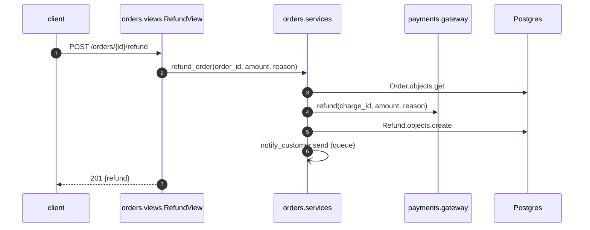

# Add refunds

Customers can refund a paid order from the order page within 30 days. The backend asks the
payment gateway for the refund, records it, and notifies the customer.

## Changes by layer

| Layer | Files | Change |
|---|---|---|
| backend views | `orders/views.py` | new `RefundView.post` |
| backend services | `orders/services.py` | new `refund_order`, the refund window |
| backend adapters | `payments/gateway.py` | new `refund` call to the gateway |
| backend models | `orders/models.py` | new `Refund`, `Order.is_refundable` |
| backend services | `orders/emails.py` | refund confirmation email body |
| web | `api/src/client.ts`, `api/src/payments.ts` | `refundOrder`, the `PaymentMethod` port |
| web | `app/src/refundButton.ts` | `requestRefund` |

## Public interface

`orders/services.py`

```python
REFUND_WINDOW_DAYS = 30

def refund_order(order_id: int, amount: float, reason: str) -> Refund: ...
```

`orders/models.py`

```python
class Refund:
    order_id: int
    gateway_id: str

def is_refundable(self) -> bool: ...
```

`payments/gateway.py`

```python
def refund(charge_id: str, amount: int, reason: str) -> str: ...
```

`orders/emails.py`

```python
def refund_confirmation(refund: Refund) -> str: ...
```

`app/src/refundButton.ts`

```ts
export async function requestRefund(orderId: number, amount: number, method: PaymentMethod): Promise<string | null>
```

## Planned flows

### Refund an order


