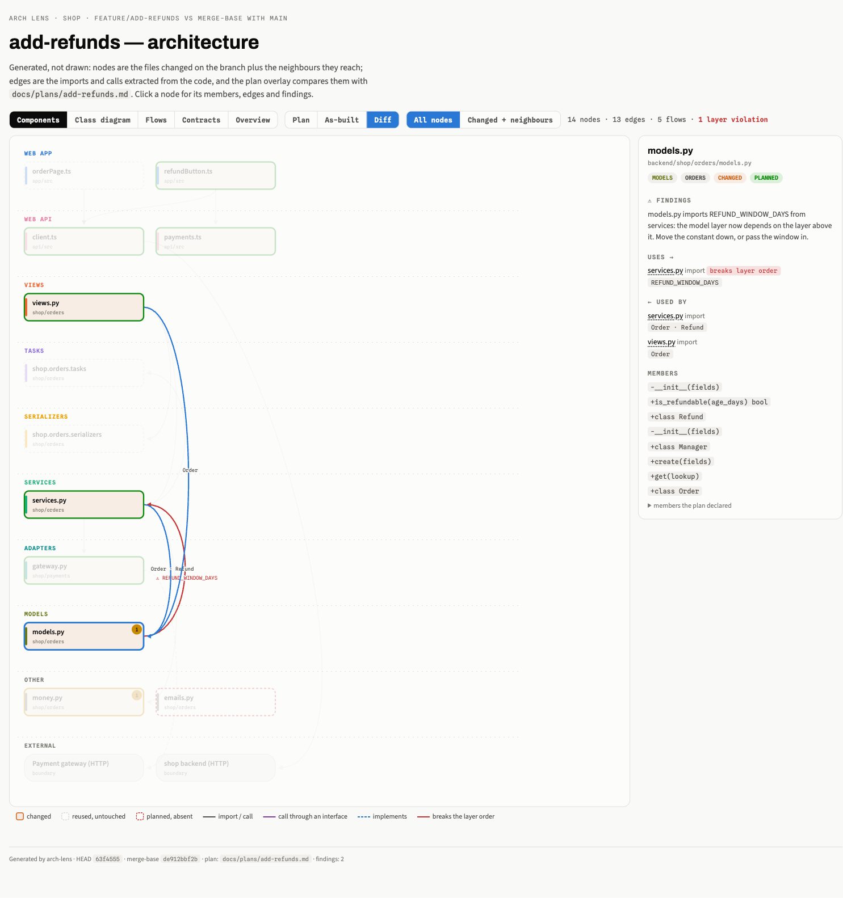
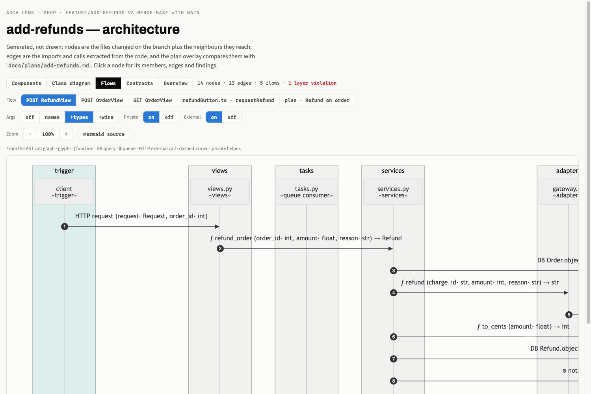
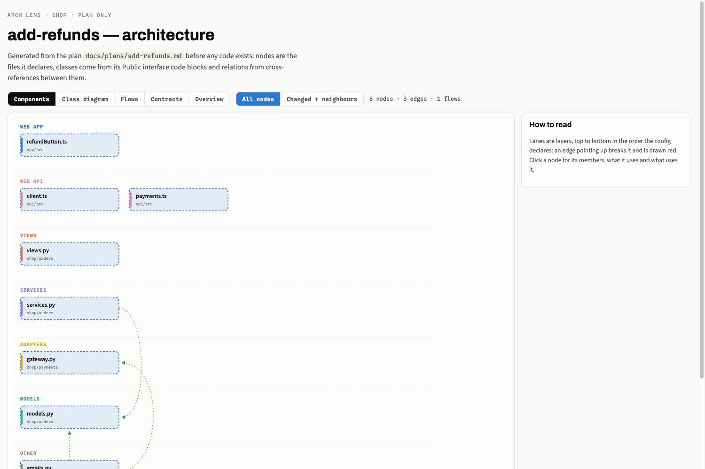

# arch-lens

*Part of [agent-workbench](../../README.md).*

**A generated architecture view of one git branch, set against the plan it was built from.**

Hand-drawn architecture diagrams go stale the day they are drawn, and they show what the
author thinks the code does. arch-lens draws the diagram *from* the code: the files a
branch changed, the imports and calls between them, the flows through them. It also
compares that picture with the plan written before the code, so a reviewer sees in one
page what was built, what was built without being planned, and what was planned but never
built.



It is also a **Claude Code plugin**. The part worth borrowing may be the workflow rather
than the tool: an agent generates the view at design sign-off from the plan alone,
generates it again from the code when the work is done, and reports every unplanned or
missing file.

> This repository is a generalised extraction of an internal tool, published as a working
> example to adapt, not as a product. Fork it and bend it to your codebase.

## What the page shows

| Tab | Where it comes from |
|---|---|
| **Components** | Changed files in lanes, one lane per layer. Edges are real imports (Python) or calls resolved by the type checker (TypeScript). An edge that points **up** the layer order is drawn red and counted as a violation. |
| **Plan / As-built / Diff** | The plan's file table set against the branch: green = planned, amber = changed without being planned, red dashed = planned but absent. |
| **Class diagram** | One class per file, grouped by layer, with members taken from the real signatures (branch-added symbols first). Generated as mermaid. |
| **Flows** | Sequence diagrams walked from entrypoints (HTTP views, queue consumers) through the call graph, showing database queries, enqueues and outbound HTTP calls with their payload keys. The plan's own sequence diagrams appear next to them. |
| **Contracts** | Every node's public surface: extracted members, or checker-printed TypeScript signatures. |
| **Overview** | A stable, hand-maintained C4 map of the system, from the config. |

Review findings can be pinned onto the files they name (`--findings`).

<p>


</p>

## Live examples

**https://nomarlo.github.io/agent-workbench/arch-lens/**: [as-built with the plan overlay](https://nomarlo.github.io/agent-workbench/arch-lens/examples/add-refunds.html)
and [plan only](https://nomarlo.github.io/agent-workbench/arch-lens/examples/add-refunds-plan-only.html).
Both are regenerated from the current code on every push to `main`.

## Try it on the example

```bash
git clone https://github.com/nomarlo/agent-workbench && cd agent-workbench/plugins/arch-lens
python3 examples/build_demo.py          # builds a throwaway git repo, writes examples/shop/output/
open examples/shop/output/add-refunds.html
```

The example is a toy shop: a layered Python backend and a TypeScript web client, plus a
"refunds" feature branch with a plan. The branch has three planted problems for the page
to find: a model that imports from the service layer (a layer violation), a helper file the
plan never mentions (unplanned), and an email module the plan promised but nobody wrote
(missing). The generated pages are also committed in
[`examples/shop/output/`](examples/shop/output/).

## Use it on your repository

Requirements: Python 3.11+ (stdlib only) and git. TypeScript extraction also needs node
and the workspace's own `typescript` package; arch-lens never installs anything into the
analysed project.

```bash
pip install "git+https://github.com/nomarlo/agent-workbench#subdirectory=plugins/arch-lens"
cp arch-lens.example.toml /path/to/your/repo/arch-lens.toml   # then edit it
cd /path/to/your/repo

arch-lens                                          # the branch vs its merge-base
arch-lens --plan docs/plans/my-feature.md          # + the plan overlay
arch-lens --plan docs/plans/my-feature.md --plan-only   # before any code exists
arch-lens --findings review.json                   # pin review findings on nodes
```

The page lands in `.arch-lens/<slug>.html`: one self-contained file that loads mermaid and
fonts from CDNs and works offline otherwise.

**The config is the whole adaptation.** [`arch-lens.example.toml`](arch-lens.example.toml)
documents every key. In short:

- `[[layers]]`: path globs per layer, top to bottom, with a `rank` that sets the allowed
  dependency direction. A layer without a rank (a task queue that goes both ways) is
  exempt from the check.
- `[python]` / `[typescript]`: where the code lives and which packages are internal.
- `[python.flows]`: what counts as an entrypoint in your framework (decorators, file
  paths, method names), and which calls are database, queue or HTTP hops.
- `[[externals]]`: boundaries found by content, such as an HTTP client's base URL.

The plan format (a file table, interface code blocks, mermaid sequence diagrams) is in
[`docs/plan-format.md`](docs/plan-format.md).

## As a Claude Code plugin

```
/plugin marketplace add nomarlo/agent-workbench
/plugin install arch-lens@agent-workbench
```

The plugin adds an `arch-lens` skill: Claude runs the generator, reads the unplanned and
missing lists back to you, publishes the page when the host can, and writes an
`arch-lens.toml` for a repository that has none by reading its structure. See
[`skills/arch-lens/SKILL.md`](skills/arch-lens/SKILL.md).

The workflow it was built for:

1. **Design sign-off.** The plan exists and the code does not. `--plan-only` turns the
   plan's file table and interface blocks into components, classes and planned flows, so
   the reviewer approves a shape rather than prose.
2. **Implementation.** Nothing to do.
3. **As-built.** `--plan` again on the finished branch. Every unplanned file is scope
   nobody agreed to, and every missing file is a promise that was not kept; both are
   reported, not silently absorbed. Layer violations are counted.
4. **Review.** Findings from human or agent reviewers are pinned on the nodes they name.

## How it works

```
extractors (per language)  ──►  model (schema/model.schema.json)  ──►  viewer (one HTML page)
```

- **Python** (`arch_lens/python_extractor.py`): the stdlib `ast`, including relative
  imports. Flows follow calls across modules, `self.` methods and `.send()`-style
  enqueues, and recognise ORM and HTTP-client calls by configurable markers.
- **TypeScript** (`arch_lens/extractors/typescript/extract.js`): the compiler API and its
  type checker, so a call through an interface (`method.confirmRefund`) resolves to the
  interface member and then fans out to every implementation.
- **The viewer** knows nothing about languages; it renders the model.

Adding a language means writing one extractor that emits the model; see
[`docs/writing-an-extractor.md`](docs/writing-an-extractor.md).

## Limits, stated

- Python flows follow statically resolvable calls. Dependency injection, dynamic
  dispatch and framework indirections (a view handing off to a serializer's `save()`)
  need `method_entries` in the config or a hand-written flow (`--extra-flows`).
- Class-diagram members are extracted from text. That keeps it working on plan fragments
  and on code the host interpreter cannot parse, at the cost of some precision.
- Plan-only relations are inferred from symbol names shared between the planned files;
  a common word can produce a false edge.
- Big deltas make big pages. The "Changed + neighbours" filter and the TypeScript hub
  threshold keep them readable, but a 300-file branch is not a diagram.

## Development

```bash
python3 -m unittest discover tests      # end to end on the example; TS tests need npm
python3 examples/build_demo.py          # regenerate the committed example pages
```

## License

MIT, see [LICENSE](LICENSE).
