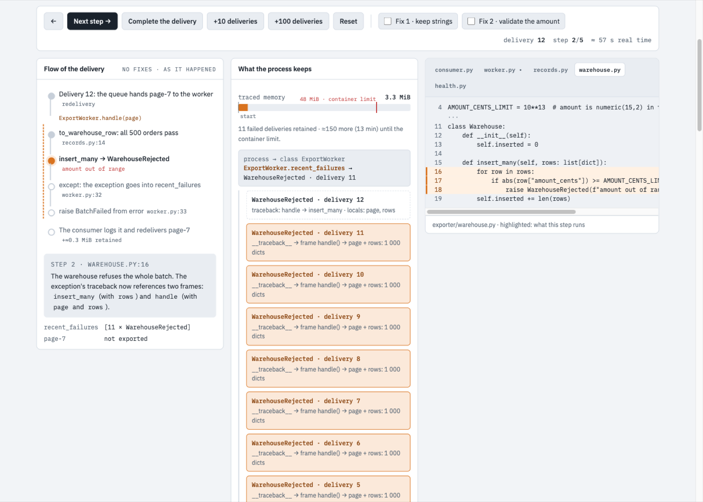

# incident-anatomy

Part of [agent-workbench](https://github.com/nomarlo/agent-workbench).

**An interactive, evidence-backed explainer page for one incident.** A step-by-step
simulation of the mechanism over the real code lines, what stays retained, the measured
evidence, and the fixes as real patches with toggles that show which path disappears.

**[Live example](https://nomarlo.github.io/agent-workbench/incident-anatomy/examples/anatomy.html)**
(a synthetic leak in a small export worker)



## Why

After an investigation, the person who found the cause understands it and nobody else
does. A written postmortem loses the part that matters: *which line, in which order, and
why the memory doesn't come back*. A hand-drawn explainer gets that across, but nobody can
tell which of its code snippets and numbers are real.

Here the author writes the explanation as data, and the renderer resolves everything
checkable:

- **Every code line is read from git** at a pinned commit, with its real line number. A
  step can only highlight lines inside the declared excerpt.
- **Every fix is a patch** (`git diff` output) that must apply cleanly to that commit;
  toggling it shows the patched code in the simulation and the diff in the fixes section.
- **Every chart and data table is drawn from a CSV** named in its caption.

If any of those fails, the page is not written. What is left to trust is the prose, and
the skill's last step has a subagent check each number and causal claim against the
evidence.

## Use it with Claude Code

```
/plugin marketplace add nomarlo/agent-workbench
/plugin install incident-anatomy@agent-workbench
```

Then, once the root cause is known: *"make an incident anatomy of this"*. The skill
covers the method: pin the commit, collect evidence into files, write the fixes as real
edits, order them from the pattern to the instance, render, verify, publish privately.

## Use it as a CLI

```bash
pip install "git+https://github.com/nomarlo/agent-workbench#subdirectory=plugins/incident-anatomy"
incident-anatomy anatomy.json --repo path/to/repo --check   # validate: files, lines, patches, data
incident-anatomy anatomy.json --repo path/to/repo           # writes anatomy.html next to it
```

Python 3.11+, stdlib only. `node`, when present, syntax-checks the emitted page script.

The format is in [docs/anatomy-format.md](docs/anatomy-format.md), and
[examples/export-leak/anatomy.json](examples/export-leak/anatomy.json) uses all of it.

## The example

`examples/export-leak/` is a small export worker with a planted bug: failed batches are
kept, as exceptions, in a class-level list for the health endpoint, so every redelivery
of a page with one bad amount retains the whole page through the traceback.

```bash
python3 examples/build_demo.py
```

This builds the repository as a real git commit and runs `measure.py`, which executes the
worker 150 times with and without each fix patch under `tracemalloc`. It then renders the
page from `anatomy.json`. The tests check the page's claims against that measurement:
memory grows without fixes, it stays flat with either fix, and the slope the simulation
uses matches the measured one.

## Limits, stated

- The simulation is a narrated model, not a trace replay: steps and retained state are
  authored; only code lines, patches and data are resolved.
- Charts are line and bar panels over CSV. Anything richer is a figure (mermaid, or an SVG
  file; scripts and event handlers are refused).
- At most four fixes can be toggled. Fixes that change overlapping lines of one file cannot
  be shown applied together.
- The page loads fonts from Google Fonts and, when it has a mermaid figure, mermaid from
  jsDelivr.

## License

MIT, see [LICENSE](LICENSE).
